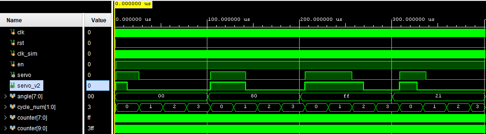

# Driving A Servo
Building off of the `fpga-pmodals` project, we'll use the code taking 
readings from the light-sensor and use that to drive a servo. The idea here is
to form a rudimentary building block for robotic interaction with the world.
Sensor information in, kinetic motion out.

Here it is in action: https://www.youtube.com/shorts/lxl4x09gqZM

Code is strictly (System)Verilog and should be FPGA agnostic, no proprietary IP.
Test benches are included. Tested using Vivado 2024.2.

Thanks to @suoglu for providing some nice Verilog interfaces to Digilent Pmods
that I was able to learn from, fork and use for this project. Especially since
Digilent [IP support ended after Vivado 2019.1](https://digilent.com/reference/learn/programmable-logic/tutorials/pmod-ips/start)

## Hardware
* Basys3 Board
* PmodALS Peripheral
* PmodCON3 Peripheral
* MG90S Servo

## Dependencies
CON3 module from https://github.com/oppaus/fpga-pmod-suite, a fork from @suoglu

# Timing Adjustments
The FPGA needs to drive the PWM between 1 to 2 milliseconds for a typical servo.
In the verilog, this gets represented as an 8-bit counter, that modulates a
pulse duration driven by a given value for an angle (0 - 180°). A 256kHz clock
has a cycle period of 3.91 µs. At that clock rate, an interval of 1-2ms requires
signal duration between 256 and 512 cycles.

Because of the servo I was using, the CON3 library needed some modification to
support a pulse-width range larger than 1ms -- being extremely new to
FGPA/Verilog this was the only way I could reason how to work out the timing, a
more seasoned verlilog veteran might know a better way. I needed to expand the
range to be from 0.5ms to 2.5ms (2ms) to get the full 180° range for the servo.

The following diagram shows the adjustment to the PWM side-by-side, the `servo_v2`
track shows the expanded 2ms range compared with the 1ms just above it. Note
that timescale shown is using a 10MHz clock, instead of a 256kHz, so the time
scale is ends up in µs, but the PW in number of cycles is correct, and will
adjust with the clock to the correct timing.

